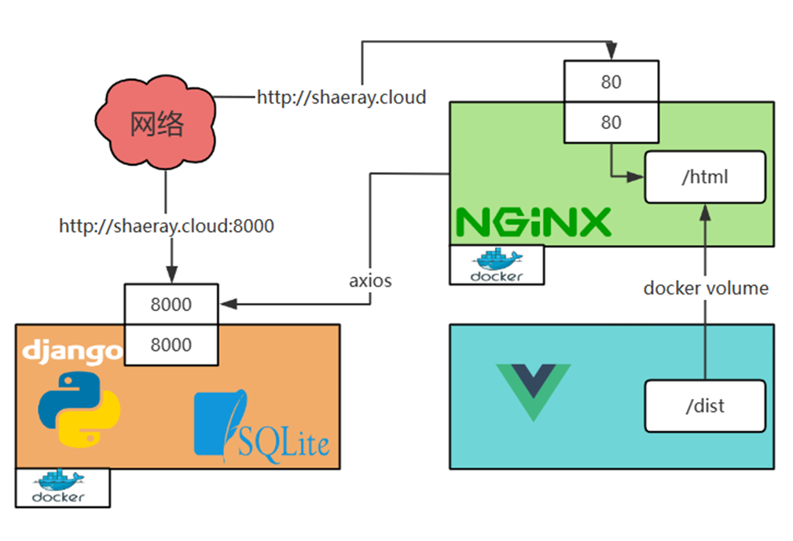
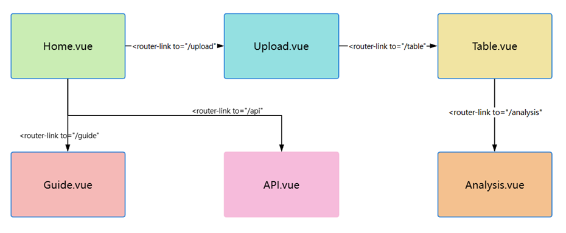
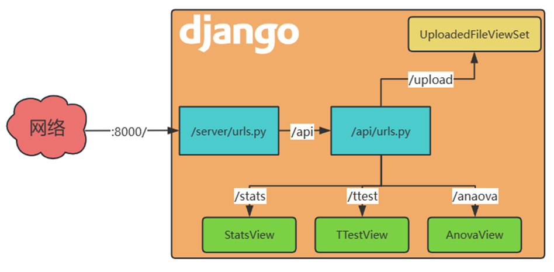

# Docker-Based Experimental Data Analysis Platform

> 基于Docker的实验数据分析平台


## Features

> 功能特点


- **File Upload**: Supports uploading files in CSV, Excel, and other formats.

  > **文件上传**：支持CSV、Excel等格式文件的上传。

- **Descriptive Statistics**: Calculates statistical indicators such as mean, median, standard deviation, and variance.

  > **描述统计**：计算平均数、中位数、标准差、方差等统计指标。

- **Correlation Coefficient Calculation**: Computes the correlation coefficient between two columns of data.

  > **相关系数计算**：计算两列数据之间的相关系数。

- **T-test**: Performs t-tests on two groups of data to compare mean differences.

  > **t检验**：对两组数据进行t检验，比较均值差异。

- **Analysis of Variance**: Conducts one-way ANOVA to determine if there are significant differences in the means of multiple groups of data.

  > **方差分析**：进行单因素方差分析，判断多组数据均值是否存在显著差异。

## Tech Stack

> 技术栈



- **Frontend**: Vue 3, Tailwind CSS, Daisy UI

  > **前端**：Vue 3、Tailwind CSS、Daisy UI

- **Backend**: Python, Django, Django REST Framework

  > **后端**：Python、Django、Django REST Framework

- **Data Analysis Libraries**: numpy, pandas, scipy

  > **数据分析库**：numpy、pandas、scipy

- **Containerization**: Docker

  > **容器化**：Docker

## Quick Start

> 快速开始

### Clone the Project

> 克隆项目

```bash
git clone https://github.com/ShaeRay/pystats.git
```

### Install Dependencies

> 安装依赖

```bash
# Frontend 前端
npm install

# Backend 后端
pip install -r requirements.txt
```

### Start the Service

> 启动服务

```bash
# Frontend 前端
npm run dev

# Backend 后端
python manage.py runserver
```

### Deploy with Docker

> 使用Docker部署

```bash
# Build Docker images 构建Docker镜像
docker build -t vue-frontend -f frontend/Dockerfile .
docker build -t django-backend -f backend/Dockerfile .

# Run containers 运行容器
docker run -d -p 80:80 --restart always --name vue -v /root/html:/usr/share/nginx/html vue
docker run -d -p 8000:8000 --restart always --name django django
```

## 目录结构





```
├── frontend/          # 前端代码
│   ├── src/
│   │   ├── components/   # 组件
│   │   ├── views/        # 页面视图
│   │   ├── assets/       # 静态资源
│   │   ├── router/       # 路由配置
│   │   └── store/        # 状态管理
│   └── Dockerfile        # 前端Docker配置
├── backend/           # 后端代码
│   ├── api/
│   │   ├── models/       # 数据模型
│   │   ├── serializers/  # 序列化器
│   │   ├── views/        # 视图
│   │   └── urls.py       # 路由
│   ├── manage.py         # Django管理脚本
│   └── Dockerfile        # 后端Docker配置
├── requirements.txt    # 后端依赖
└── README.md           # 项目说明
```

